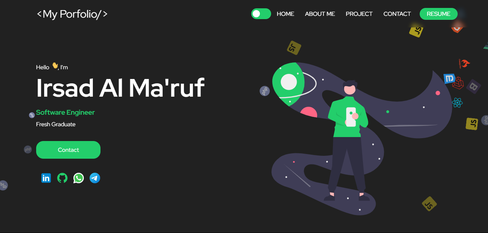
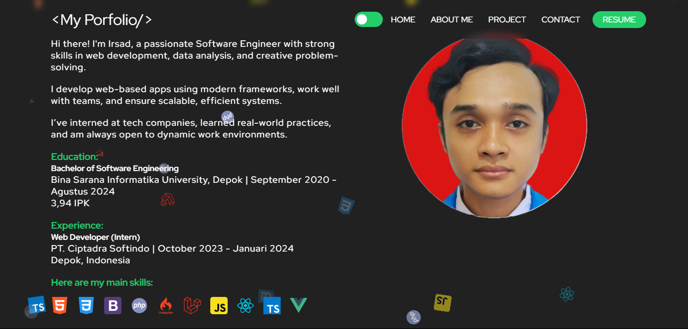

# My Portfolio

Welcome to my personal portfolio! This project showcases my skills as a web developer, including my experience in **React.js**, **TypeScript**, and **Styled Components**. The portfolio is designed to provide an interactive and visually appealing way to present my work and projects.

---

## 🚀 Features

- **Responsive Design**: The portfolio is fully responsive, making it accessible across all devices.
- **Modern UI/UX**: Using **Styled Components** for custom styling and **React.js** for efficient rendering.
- **Interactive Sections**: Includes project showcases, contact information, and a personal introduction.
- **Multi-Section Layout**: Clear sections for my background, skills, projects, and more.

---

## 🛠️ Technologies Used

- **React.js**: JavaScript library for building user interfaces.
- **TypeScript**: Superset of JavaScript that adds static typing, improving maintainability and scalability.
- **Styled Components**: A library for styled components that allows scoped and dynamic styles within the JavaScript code.
- **HTML/CSS**: Markup and styling for the webpage structure and design.

---

## 📸 Screenshots

  

  

